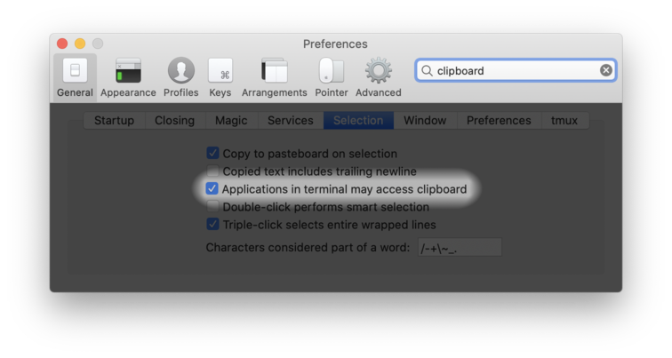

## 剪贴板

通常希望将从 tmux 的复制模式或用鼠标在 tmux 中复制的文本与系统剪贴板同步。终端提供给 tmux 的工具相当粗糙且支持不一致。本文档概述了工作原理和一些配置示例。

有两种可能的方法：

* OSC 52 和 `set-clipboard` 选项。

* 管道传输到外部工具，如 `xsel`。

请注意，在对 `.tmux.conf` 进行更改后，应完全重启 tmux（运行 `tmux kill-server`）。

### `set-clipboard` 选项

#### 工作原理

一些终端提供了一个转义序列来设置剪贴板。这是操作系统控制序列之一，因此被称为 OSC 52。

要跳过详细信息并阅读配置 `set-clipboard` 的快速逐步说明，请跳到 [此节](Clipboard#quick-summary)。

其工作原理是，当在 tmux 中复制文本时，它会被打包并通过类似于 tmux 绘制文本、颜色和属性的方式发送到外部终端。外部终端识别剪贴板转义序列并设置系统剪贴板。

tmux 通过 `set-clipboard` 选项支持此功能。其巨大优势是即使未配置 X11 转发，它也能通过 *ssh(1)* 连接工作。缺点是支持不均匀且配置可能很棘手。

要使 `set-clipboard` 工作，必须具备以下三个条件：

1. `set-clipboard` 选项必须设置为 `on` 或 `external`。默认值为 `external`。

2. 当 tmux 查看由 `TERM` 指定的 *terminfo(5)* 条目时，`Ms` 功能必须对 tmux 可用。默认情况下，某些终端已具备此功能，如果没有，则通过 `terminal-overrides` 或 `terminal-features` 添加（见下一节）。

3. 终端本身必须启用此功能。如何做到这一点因终端而异。有些默认启用，有些则不启用。

以下两节展示了如何配置 `set-clipboard` 和 `Ms`；后面几节涵盖了不同终端的支持情况。

#### 更改 `set-clipboard`

tmux `set-clipboard` 选项在 tmux 1.5 中添加，默认值为 `on`；当在 tmux 2.6 中添加 `external` 时，默认值更改为 `external`。

区别在于 `on` 既使 tmux 设置外部终端的剪贴板，又允许 tmux 内部的应用程序设置 tmux 的剪贴板（添加粘贴缓冲区）。`external` 仅使 tmux 设置剪贴板，并禁止内部应用程序这样做。

这些命令中的任何一个在 `.tmux.conf` 中或在命令提示符下都将设置三种状态：

~~~~
set -s set-clipboard on
set -s set-clipboard external
set -s set-clipboard off
~~~~

#### 设置 `Ms` 功能

默认情况下，tmux 为 `TERM` 匹配 `xterm*` 的终端添加 `Ms` 功能。可以在 tmux 外部检查 `TERM`：

~~~~
$ echo $TERM
~~~~

要查看 `Ms` 是否已设置，请在 *tmux 内部*运行此命令：

~~~~
$ tmux info|grep Ms:
 180: Ms: (string) \033]52;%p1%s;%p2%s\a
~~~~

如果 `Ms` 像这样显示，则不需要添加。如果显示 `[missing]`，则必须通过 `terminal-overrides` 或 `terminal-features` 添加。检查 tmux 外部的 `TERM`：

~~~~
$ echo TERM
rxvt-unicode-256color
~~~~

然后添加适当的 `.tmux.conf` 行。对于 tmux 3.2 或更高版本，如下所示（将 `rxvt-unicode-256color` 更改为 `TERM` 中的适当名称）：

~~~~
set -as terminal-features ',rxvt-unicode-256color:clipboard'
~~~~

或者对于较旧的 tmux 版本：

~~~~
set -as terminal-overrides ',rxvt-unicode-256color:Ms=\E]52;%p1%s;%p2%s\007'
~~~~

可以为不同的 `TERM` 值在 `.tmux.conf` 中添加多个类似的行（`-a` 表示追加到选项）。它还支持通配符，因此使用 `rxvt-unicode*` 将适用于 `rxvt-unicode` 和 `rxvt-unicode-256color`。

#### 安全问题

如果 `set-clipboard` 设置为 `external`，只有 tmux 可以设置剪贴板。如果设置为 `on` 且 tmux 版本为 2.6 或更高，则在 tmux 内运行的任何应用程序都可以创建 tmux 粘贴缓冲区并设置系统剪贴板。无论命令是用 *su(1)* 还是 *sudo(1)* 运行都不重要 - 如果命令可以向 tmux 窗格写入文本，它就可以设置剪贴板。

这意味着当 `set-clipboard` 设置为 `on` 时，必须非常小心在 tmux 内运行不受信任的命令。

如果在终端中启用了 OSC 52，同样的情况也适用于在没有 tmux 的情况下运行的任何命令。

#### 终端支持 - tmux 内的 tmux

如果在 tmux 内运行 tmux，则内部 tmux 的外部终端是 tmux：

- 内部 tmux 必须像其他终端一样配置 `set-clipboard` 和 `Ms`。`TERM` 将是 `screen` 或 `screen-256color` 或 `tmux` 或 `tmux-256color`。

- 外部 tmux 必须将 `set-clipboard` 设置为 `on` 而不是 `external`，并且必须为其外部终端配置 `Ms`，无论其是什么。

- 外部终端必须启用 OSC 52。

#### 终端支持 - xterm

xterm 支持 OSC 52，但默认情况下是禁用的。可以通过在 `.Xresources` 或 `.Xdefaults` 中放置以下内容来启用：

~~~~
XTerm*disallowedWindowOps: 20,21,SetXprop
~~~~

#### 终端支持 - VTE 终端

VTE 终端（GNOME 终端、XFCE 终端、Terminator）不支持 OSC 52 转义序列。

大多数会忽略它，但某些版本不会，而是在终端中打印它 - 这表现为覆盖任何现有文本的大量字母和数字。要解决此问题，请关闭 `set-clipboard`：

~~~~
set -s set-clipboard off
~~~~

#### 终端支持 - Kitty

Kitty 确实支持 OSC 52，但它有一个错误，即每次复制文本时都会追加到剪贴板而不是替换它。

可以通过修改 `kitty.conf` 文件添加 `no-append` 来解决此错误：

~~~~
clipboard_control write-primary write-clipboard no-append
~~~~

#### 终端支持 - rxvt-unicode

rxvt-unicode 本身不支持 OSC 52。有一个非官方的 Perl 扩展 [在这里](http://anti.teamidiot.de/static/nei/*/Code/urxvt/)。

#### 终端支持 - st

st 支持 OSC 52，但 0.8.3 之前的版本对可复制文本的数量有限制，因此文本可能会被截断。

#### 终端支持 - iTerm2

iTerm2 支持 OSC 52，但必须在首选项中启用此选项：

#### 快速摘要

总之，要配置 `set-clipboard`，请按照以下步骤操作：

1. 确保在 tmux 中设置了 `set-clipboard`：

    ~~~~
    $ tmux show -s set-clipboard
    external
    ~~~~

    如果不是 `on` 或 `external`，请在 `.tmux.conf` 中添加此内容并重启 tmux
    （在 tmux 2.6 之前使用 `on` 而不是 `external`）：

    ~~~~
    set -s set-clipboard external
    ~~~~

2. 确保设置了 `Ms`。启动 tmux 并运行：

   ~~~~
   $ tmux info|grep Ms
   180: Ms: [missing]
   ~~~~

   如果是 `[missing]`，请在 tmux 外部获取 `TERM` 的值：

   ~~~~
   $ echo $TERM
   rxvt-unicode-256color
   ~~~~

   然后在 `.tmux.conf` 中添加适当的 `terminal-features` 或 `terminal-overrides` 行并重启 tmux。对于 tmux 3.2 或更高版本：

   ~~~~
   set -as terminal-features ',rxvt-unicode-256color:clipboard'
   ~~~~

   或者对于较旧的 tmux 版本：
   
   ~~~~
   set -as terminal-overrides ',rxvt-unicode-256color:Ms=\E]52;%p1%s;%p2%s\007'
   ~~~~

   然后启动 tmux 并通过在 tmux 内运行以下命令检查是否已生效：

   ~~~~
   $ tmux info|grep Ms:
   180: Ms: (string) \033]52;%p1%s;%p2%s\a
   ~~~~

3. 如有必要，在终端选项中启用支持，或使用默认启用它的终端。

### 外部工具

#### 可用工具

使用 `set-clipboard` 的替代方法是使用外部工具设置剪贴板。tmux 有一种方法可以将复制的文本管道传输到命令而不是仅创建粘贴缓冲区。可以更改复制键绑定来执行此操作。

可用的工具有：

- 在 Linux 和 *BSD 上，有 *xsel(1)* 和 *xclip(1)* 工具，通常
  作为包提供。

- macOS 有一个内置工具叫做 *pbcopy(1)*。

这些工具直接与 *X(7)* 服务器（或等效物）通信，因此无需
额外配置，它们只能在本地计算机上工作。

#### 如何配置 - tmux 3.2 及更高版本

tmux 3.2 引入了一个名为 `copy-command` 的选项，用于设置所有键绑定的管道命令。当不带参数调用 `copy-pipe` 时使用此选项，这现在是默认设置。如果选项为空，则不会管道传输复制的文本。

要管道传输到 *xsel(1)*：

~~~~
set -s copy-command 'xsel -i'
~~~~

下一节中的更复杂配置也适用于 tmux 3.2 及
更高版本。

#### 如何配置 - tmux 2.4 到 3.1

要在 tmux 3.2 之前的 tmux 中使用这些工具，必须
更改复制键绑定。与默认的 `copy-selection-and-cancel` 等效的命令是
`copy-pipe-and-cancel`；如果使用 `copy-selection`，则使用 `copy-pipe`，或
对于 `copy-selection-no-clear`，使用 `copy-pipe-no-clear`。

复制键绑定是：

* 使用 *emacs(1)* 键时为 `C-w` 和 `M-w`（`mode-keys` 设置为 `emacs`）。

* 使用 *vi(1)* 键时为 `C-j` 和 `Enter`（`mode-keys` 设置为 `vi`）。

* 用于鼠标复制的 `MouseDragEnd1Pane`。

这些必须针对正在使用的键表进行更改。对于 *emacs(1)* 键：

~~~~
bind -Tcopy-mode C-w               send -X copy-pipe-and-cancel 'xsel -i'
bind -Tcopy-mode M-w               send -X copy-pipe-and-cancel 'xsel -i'
bind -Tcopy-mode MouseDragEnd1Pane send -X copy-pipe-and-cancel 'xsel -i'
~~~~

或者对于 *vi(1)* 键：

~~~~
bind -Tcopy-mode-vi C-j               send -X copy-pipe-and-cancel 'xsel -i'
bind -Tcopy-mode-vi Enter             send -X copy-pipe-and-cancel 'xsel -i'
bind -Tcopy-mode-vi MouseDragEnd1Pane send -X copy-pipe-and-cancel 'xsel -i'
~~~~

#### 如何配置 - tmux 2.3 及更早版本

在 tmux 2.4 中，复制模式键绑定完全改变，因此可以在复制模式中绑定 tmux
命令，而不是一组有限的仅复制模式命令。较旧版本的 *emacs(1)* 键配置如下所示：

~~~~
bind -temacs-copy C-w               copy-pipe 'xsel -i'
bind -temacs-copy M-w               copy-pipe 'xsel -i'
bind -temacs-copy MouseDragEnd1Pane copy-pipe 'xsel -i'
~~~~

或者对于 *vi(1)* 键：

~~~~
bind -tvi-copy C-j               copy-pipe 'xsel -i'
bind -tvi-copy Enter             copy-pipe 'xsel -i'
bind -tvi-copy MouseDragEnd1Pane copy-pipe 'xsel -i'
~~~~

#### `set-clipboard` 和 `copy-pipe`

如果在也支持 `set-clipboard` 的终端中使用 `copy-pipe` 方法，两者可能会冲突。在这种情况下，最好禁用 `set-clipboard`：

~~~~
set -s set-clipboard off
~~~~

#### 常见问题 - `DISPLAY`

因为 *xsel(1)* 和 *xclip(1)* 工具需要与 *X(7)* 服务器通信，
它们需要设置 `DISPLAY` 环境变量。这通常不是
问题，但如果缺失（例如如果在 *X(7)* 外启动 tmux），
可以通过类似以下方式设置：

~~~~
$ tmux setenv -g DISPLAY :0
~~~~

#### 常见问题 - *xclip(1)*

*xclip(1)* 有一个错误，它不会正确关闭 `stdout`，因此 tmux 不
知道它已完成并且不会响应任何进一步的按键。最简单的
修复方法是将 `stdout` 重定向到 `/dev/null`：

~~~~
xclip >/dev/null
~~~~

#### 常见问题 - 错误的剪贴板

*X(7)* 有几个剪贴板。如果复制的文本不可用，请查看：

* *xsel(1)* 的 `-p`、`-s` 和 `-b` 标志

* *xclip(1)* 的 `-selection` 标志。
