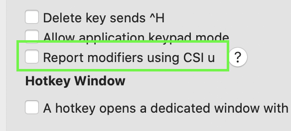

## 修饰键

**从 tmux 3.5 开始，本文档已过时；tmux 现在默认支持 `extended-keys`，方式类似于 xterm。**

终端支持三个修饰键：`Ctrl`、`Meta`（通常是现代键盘上的 `Alt`）和 `Shift`，但哪些键支持哪些修饰符以及它们如何表示给 tmux 在不同终端之间有所不同。本文档概述了这些键的工作原理以及一些故障排除的帮助。

### 终端按键的样子

终端以三种形式将按键发送给 tmux：

- 普通 ASCII 或 UTF-8 按键按原样发送（`a` 就是 `a`）。

- `Ctrl` 与 ASCII 按键一起使用 ASCII 控制字符发送（`C-a` 是 ASCII 1）。

- `Meta` 在按键前加上单个 ASCII `ESC` 字符（ASCII 27，有时写成 `^[`、`\033`、`\e` 或 `\E`）。所以 `M-a` 是 `^[a`。

- 功能键以 ASCII `ESC` 为前缀的特殊序列发送。不同按键的确切序列各不相同。

需要注意的是：

- 终端应用程序（如 tmux）可用的按键不一定与终端本身可用的按键相同，例如 *X(7)* 程序拥有的按键范围比可传递给终端应用程序的要大得多。

- 终端按键序列与 *X(7)* 键符号（由 *xmodmap(1)* 或 *xev(1)* 使用）或 Linux 控制台使用的按键无关。

### tmux 如何描述带修饰符的按键

tmux 使用以下三个前缀之一来描述带修饰符的按键：

- `C-` 表示 `Ctrl` 按键；

- `M-` 表示 `Meta` 按键；

- `S-` 表示 `Shift` 按键。

这些可以组合，所以 `Ctrl` 和 `Meta` 和 `Left` 是 `C-M-Left`。

许多带 `Shift` 的按键有替代名称，tmux 使用存在的名称。
所以没有 `S-a` - 它只是大写：`A`。同样，`S-Tab` 是
`BTab`。`S-` 前缀用于一些只有单一形式的功能键，
例如 `S-Left` 和 `S-Right`。

### `Ctrl` 按键的限制

只有 32 个 ASCII 控制字符，所以在大多数终端中只有
32 个 `Ctrl` 按键：

- `C-@` 是 ASCII 0；

- `C-a` 到 `C-z` 是 ASCII 1 到 ASCII 26；

- `C-[`、`C-\`、`C-]`、`C-^` 和 `C--` 是 ASCII 27 到 31。

其中一些用于多个按键，包括：

- `C-@` 也是 `C-Space`；

- `C-[` 也是 `Escape`；

- `C-i` 也是 `Tab`；

- `C-m` 也是 `Enter`；

- `C--` 也是 `C-_`；

- `C-^` 也是 `C-/`。

这意味着无法将 `C-@` 和 `C-Space` 绑定到不同的
内容，而在大多数终端上无法绑定一些按键如 `C-!` 或
`C-1`。

少数终端有一个功能允许使用这些按键，参见 [此节](Modifier-Keys#extended-keys)。

### `Shift` 按键的限制

大多数 ASCII 按键在键盘上都有一个标记的 `Shift` 形式，当
按下 `Shift` 时发送。例如在英国 QWERTY 键盘上，按下
`S-1` 将发送 `!`。tmux 不知道键盘布局，所以它将 `!` 视为
`!` 而不是 `S-1`。没有办法表达按键 `S-1` - 使用 `!` 代替。

`Shift` 修饰符和 `S-` 前缀主要用于功能键
如 `S-F1` 或 `S-Left`。

### UTF-8 按键的限制

UTF-8 按键没有 `Ctrl` 或 `Shift` 形式，所以它们不能与
这些修饰符一起使用。因为 `Meta` 通过发送 `^[` 前缀工作，UTF-8
字符可以与 `Meta` 修饰符一起使用。

### 退出键

因为 `Escape` 键是 `^[`，这也是 `Meta` 和
功能键使用的前缀，tmux 需要确定单个 `^[` 是 `Escape`
键还是更长序列的一部分。它使用计时器来实现：

- 当看到 `^[` 字节时，tmux 启动计时器；

- 如果在计时器用完之前有更多数据传入，tmux 可以确定
  `^[` 是否是更长序列的一部分；

- 或者如果计时器到期，则按键是 `Escape`。

这就是为什么按下 `Escape` 和 tmux 将
按键传递给内部应用程序之间可能会有延迟。计时器的长度由
`escape-time` 选项控制，默认是 500 毫秒（半秒）。

### 常见功能键

终端发送给 tmux 的功能键序列可能不同，但对于
常见按键，tmux 可以从 *terminfo(5)* 获取序列。

这意味着尽管它们在不同终端之间可能不同，但通常可以工作。
例如 `Home` 在 `khom` 功能中，在 tmux 和
*xterm(1)* 之间不同。`tput` 或 `infocmp` 命令可用于检查
*terminfo(5)* 功能。

~~~~
$ tput -Ttmux khom|cat -v; echo
^[[1~
$ tput -Txterm khom|cat -v; echo
^[OH
~~~~

因为 tmux 可以读取 `khom`，它可以正确识别此
按键的序列。此外，tmux 对一些常见序列有内置支持。

### 修饰符和功能键

对修饰符和功能键的支持，如 `C-F1` 或 `C-S-Left`，并不
总是存在，这些通常是引起最多麻烦的按键。

*xterm(1)* 为这些按键提供了一个描述性序列，许多其他
终端也使用这个序列，这在按键序列中包含一个数字来表示
修饰符，所以 `C-Left` 是 `^[[1;5D`，其中 5 表示 `Ctrl` 且：

- 2 是 `Shift`；
- 3 是 `Meta`；
- 4 是 `Shift` 和 `Meta`；
- 6 是 `Shift` 和 `Ctrl`；
- 7 是 `Meta` 和 `Ctrl`；
- 8 是 `Shift` 和 `Meta` 和 `Ctrl`。

这些形式仅用于现代终端支持的功能键 -
传统硬件终端上提供的按键通常仍然使用
它们的原始序列。

所有 tmux 版本都识别这种形式的按键，从 tmux 2.4 开始，tmux 默认将其发送给
内部运行的应用程序。在旧版本中，必须启用
`xterm-keys` 选项：

~~~~
set -g xterm-keys on
~~~~

### 扩展键

少数终端支持扩展键序列，这允许 tmux
识别一些以前不可用的按键，如 `C-1` 和
其他在 [此节](Modifier-Keys#limitations-of-ctrl-keys)) 中提到的控制键。参见 [此文
档](http://www.leonerd.org.uk/hacks/fixterms/) 了解按键编码的技术
描述。

tmux 从 tmux 3.2 开始支持此功能。

要使此功能工作，必须具备以下三个条件：

1) 终端必须支持它：*xterm(1)*、
   [mintty](https://mintty.github.io/) 和 [iTerm2](https://www.iterm2.com/)
   目前支持此功能。iTerm2 需要在配置文件中设置此选项：

   

2) 必须告诉 tmux 打开它：

   ~~~~
   set -s extended-keys on
   ~~~~

3) tmux 必须识别终端支持它。tmux 将自动
   检测这三个终端的新版本，但如果未检测到，则
   `terminal-features` 选项也可以修改以手动启用它：

   ~~~~
   set -as terminal-features 'xterm*:extkeys'
   ~~~~

启用此功能后，tmux 将为自己的按键绑定识别扩展键，并在内部应用程序请求时将它们转发给应用程序。
例如，发送转义序列以打开它，然后运行 *cat(1)* 并
按下 `C-1` 将显示：

~~~~
$ printf '\033[>4;1m'
$ cat
^[[49;5u
~~~~

### 为什么按键可能不起作用

要使按键工作，必须满足两个条件：

1) tmux 和它运行的终端必须对按键发送的序列达成一致；以及

2) tmux 和内部运行的应用程序必须对按键发送的序列达成一致。

终端发送给 tmux 的序列和 tmux 发送给内部应用程序的序列不必相同 - 这是 tmux 的工作来转换。
但如果 tmux 和终端或 tmux 和应用程序不一致，
按键将无法识别。

### 查看按键发送的内容

查看按键发送内容的最简单方法是在 shell 提示符下使用 *cat(1)*。例如，运行 *cat(1)* 并在 tmux 中按下 `C-Left` 显示：

~~~~
$ cat
^[[1;5D
~~~~

### 故障排除步骤

如果按键不起作用，首先要做的是确定 tmux 本身是否
识别该按键。最简单的方法是尝试绑定它，
例如运行 tmux 然后：

~~~~
$ tmux bind -n TheKey lsk
~~~~

然后如果按下按键显示 `list-keys` 输出，tmux 正在识别该
按键。如果它不识别的步骤在下一节中；如果识别
则在接下来的节中。

#### tmux 未识别按键

如果 tmux 按键绑定不起作用，则：

1) 检查在 tmux 外部按键时是否有内容发送。
   如果按下按键时 *cat(1)* 中没有显示任何内容，则终端未发送该按键。
   也许终端自己使用它或窗口管理器使用它
   代替。

2) 对于带修饰符的按键，确保在 tmux 外部按键时发送的序列
   与不带修饰符时不同。如果 `C-TheKey` 和 `TheKey` 在 *cat(1)* 中显示
   相同的内容，tmux 无法区分差异 - 要么
   终端不支持该按键，要么需要额外配置。

3) 确保 `TERM` 正确。tmux 从 `TERM` 获取一些按键信息。
   检查终端文档以查看在 tmux 外部 `TERM` 应该设置为什么。

4) 如果这些都不起作用，请在此处打开一个问题
[这里](https://github.com/tmux/tmux/issues)

#### tmux 识别按键

如果 tmux 按键绑定工作，但 tmux 内部的应用程序未识别
该按键：

1) 检查在 tmux 内部使用 *cat(1)* 时按键是否显示内容。如果没有
   显示内容，请确保根表中没有按键绑定。

2) 如果 *cat(1)* 显示一些输出，请确保 tmux 内部的 `TERM` 正确。如果
   是 `screen` 或 `screen-256color`，请尝试更改为 `tmux` 或
   `tmux-256color`（如果可用）。使用 *infocmp(1)* 检查它们是否可用：

   ~~~~
   $ infocmp -x tmux-256color
   #       Reconstructed via infocmp from file: /usr/share/terminfo/t/tmux-256color
   tmux-256color|tmux with 256 colors,
   ...
   ~~~~

   如果可用，请在 `.tmux.conf` 中设置 `default-terminal`：

   ~~~~
   set -g default-terminal tmux-256color
   ~~~~

3) 如果 `TERM` 正确且 *cat(1)* 在按下按键时显示输出，
   问题可能出在应用程序上。检查其文档是否
   有关于如何配置按键绑定的任何信息。

### 数字键盘

在大多数终端中，数字键盘发送数字（`1`、`2` 等）
或功能键（`Home`、`Up` 等）。使用其中任何一个，tmux 都无法
区分这些按键与普通数字键或功能键。

一些终端还允许 tmux 将键盘置于"应用程序
模式"，这允许它单独识别按键，以便它们可以作为
按键绑定使用。要检查终端是否支持此功能，请发送 `smkx` 功能
使用 *tput(1)*，然后使用 *cat(1)* 查看键盘上的 `1` 键：

~~~~
$ tput smkx
$ cat
^[Oq
~~~~

如果这显示 `^[Oq`，则支持此模式。如果显示其他内容，
则不支持或终端需要额外配置以启用
它。
